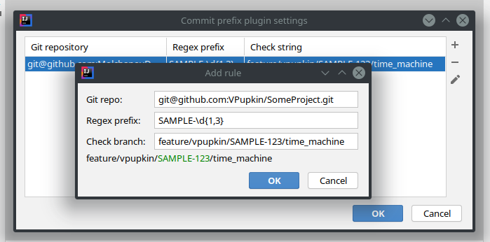
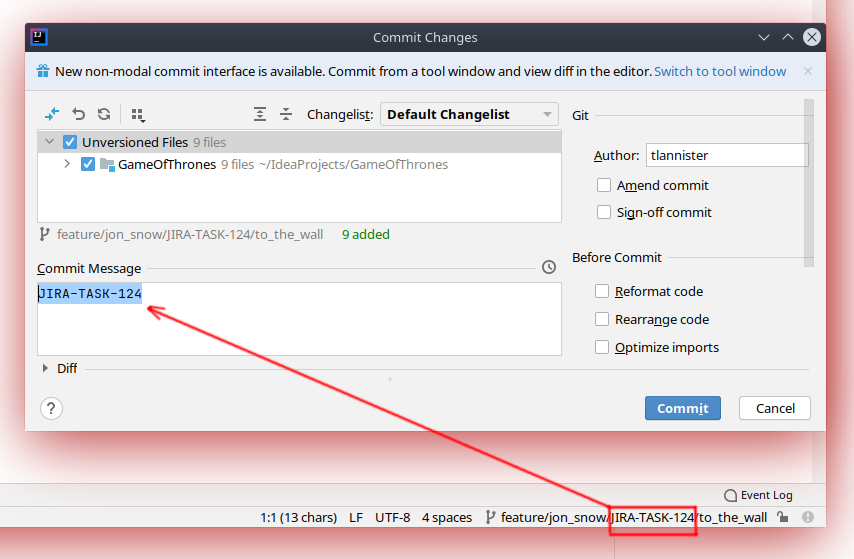

# Commit prefix plugin 
Helps you to insert the task number from current branch to the beginning of the commit message.

## Instruction
1. Wait project indexing.
2. Open Tools -> Commit Prefix Plugin.
3. Add rule:

4. Now your commit changes dialog always has actual task prefix in commit message:

